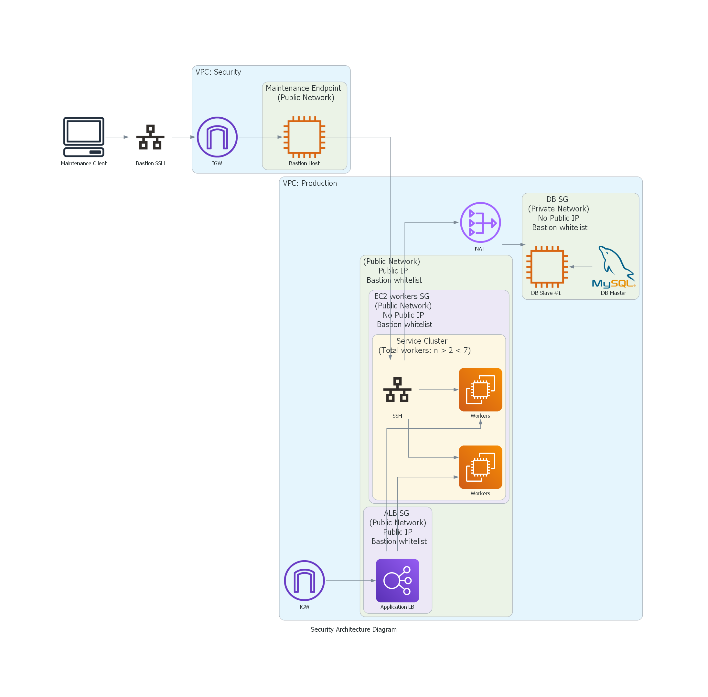

## AWS Fullstack Web App
The final project for the AWS course is to deploy a fullstack cloud native web app with specific [requirements (checklist can be found here)](./Checklist.md).

Cloud Architecture
The following is the proposed architecture and devices required for the web app deployment:

Security Architecture Plan

### Dependencies
#### Diagrams - Architecture diagrams
- DAC (Diagrams as Code): The python package used for Architecure diagramming is [Diagrams by mingrammer](https://diagrams.mingrammer.com/).
>(Note: when installing diagrams.mingrammer in Windows add the installation to PATH in environment variables as shown in this [tutorial](https://www.youtube.com/watch?v=XnxIfoUQeWw&ab_channel=AscendingDeer))

