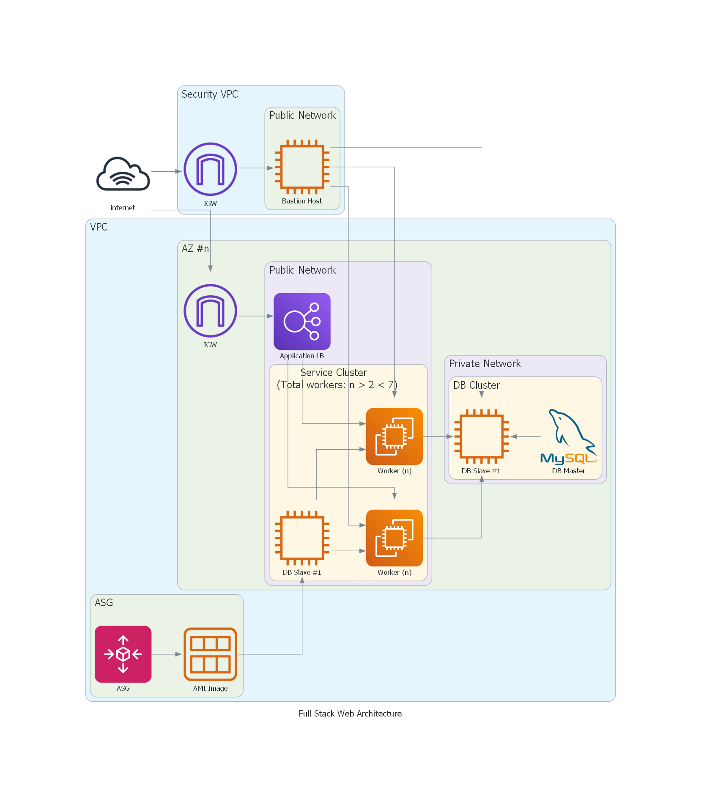

## AWS Fullstack Web App

Cloud Architecture

App Architecture

### Dependencies
#### Diagrams - Architecture diagrams
- DAC (Diagrams as Code): The python package used for Architecure diagramming is [Diagrams by mingrammer](https://diagrams.mingrammer.com/).
>(Note: when installing diagrams.mingrammer in Windows add the installation to PATH in environment variables as shown in this [tutorial](https://www.youtube.com/watch?v=XnxIfoUQeWw&ab_channel=AscendingDeer))
